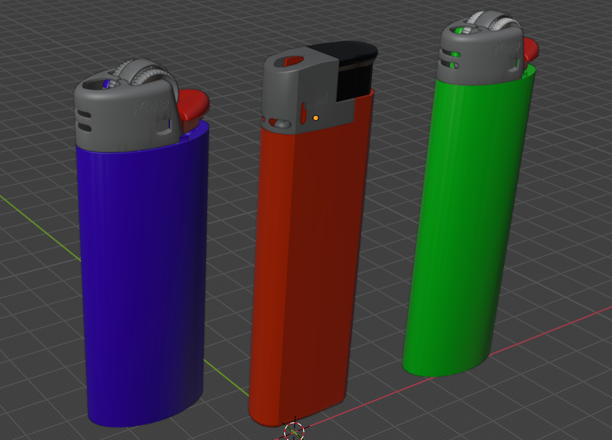
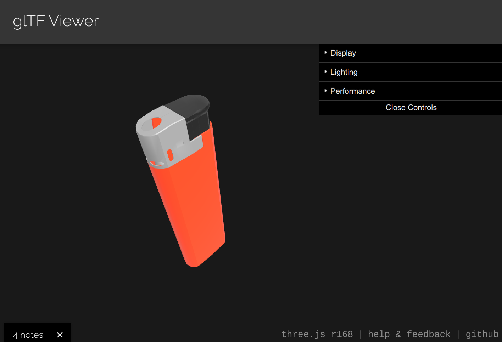
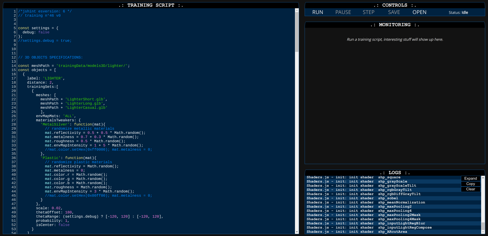
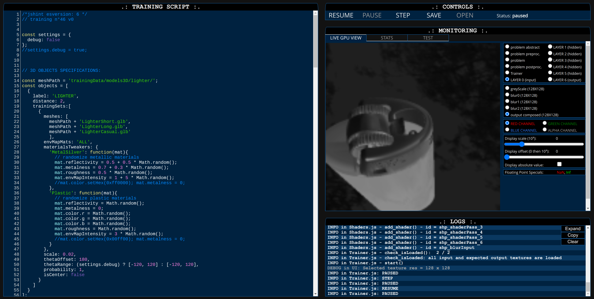
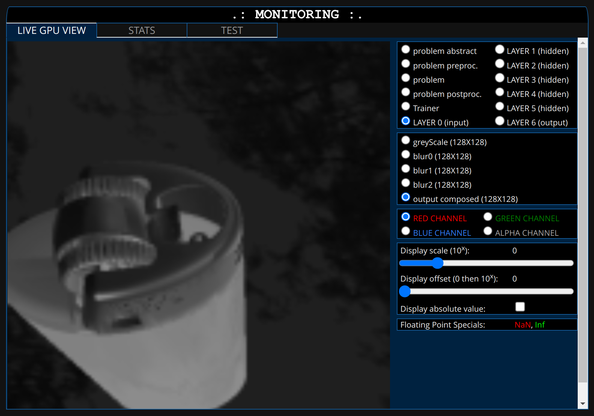
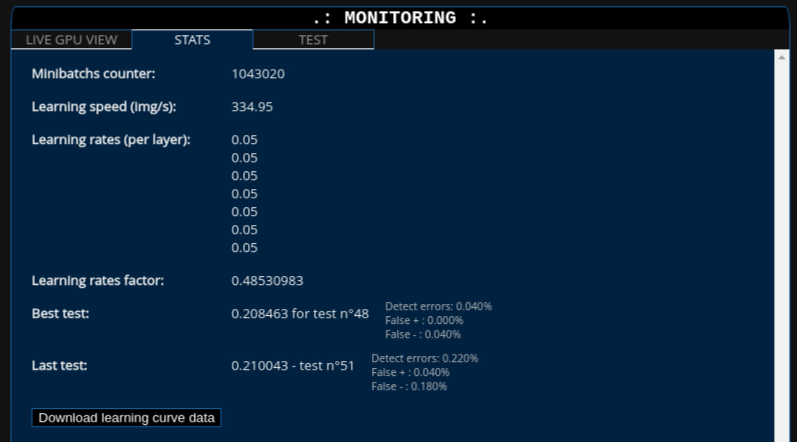

# WebAR Application Tutorial: A Dragon Lights a Lighter

## Table of Contents

- [Objectives](#objectives)
- [The 3D Model](#the-3d-model)
  - [Find and Download](#find-and-download)
  - [Align and Clean](#align-and-clean)
- [Train the Neural Network](#train-the-neural-network)
  - [Hardware Requirements](#hardware-requirements)
  - [Launching WebAR.rocks.train](#launching-webar-rocks-train)
  - [The User Interface](#the-user-interface)
    - [Training Script](#training-script)
    - [Controls](#controls)
    - [Monitoring](#monitoring)
    - [Logs](#logs)
  - [Training the Neural Network](#training-the-neural-network)
  - [Monitoring of the Training](#monitoring-of-the-training)
    - [Live GPU View](#live-gpu-view)
    - [Stats](#stats)
    - [Test](#test)
  - [Save and Download](#save-and-download)
- [Use the NN with WebAR.rocks.object](#use-the-nn-with-webar-rocks-object)
  - [Run the Boilerplate](#run-the-boilerplate)
  - [How It Works](#how-it-works)
  - [Customize the Boilerplate](#customize-the-boilerplate)
  - [Deploy the WebAR App](#deploy-the-webar-app)
- [Conclusion](#conclusion)

---

## Objectives

In this tutorial, we will learn:

- How to train a neural network model to detect an object (a lighter)
- How to display an augmented reality overlay on the object using this neural network

Do you have a simple lighter? Test the web application at [webar.rocks/demos/lighter](https://webar.rocks/demos/lighter).

---

## The 3D Model

### Find and Download

We train a neural network using images rendered from a 3D model. It is easier to obtain a 3D model than to take thousands of pictures of the same object.

If you don't have 3D artist skills, here are some websites where you can find and download 3D models:

* [Sketchfab](https://sketchfab.com/)
* [CG Trader](https://www.cgtrader.com/)
* [Blender Market](https://blendermarket.com/)

Some mobile applications can scan an object to create a 3D model, such as [PolyCam](https://poly.cam/).  
Generative A.I. can also create 3D models from pictures. You can try [Meshy](https://www.meshy.ai/), [Hyper3D](https://hyper3d.ai/), or [Tencent Hunyuan 3D](https://github.com/Tencent/Hunyuan3D-2).

3D scanning and generative AI mesh generation often produce meshes with random topologies, which can be hard to edit. They also do not work very well with refractive or reflective materials (e.g., glass, silver, gold, ...).

If the object has variability, it is better to have several 3D models to cover the variations. For example, a simple lighter can be short, long, have a wheel, or be electronic:

<p align="center">
  
</p>

### Align and Clean

Each mesh should have these specifications:

- **Format:** GLB, with textures packed inside.
- **Complexity:** It is best to have fewer than 100,000 polygons; otherwise, training will be slower.
- **Visual Transforms and Blender Modifiers:** These should be applied before exporting the mesh.

We strongly recommend using [Blender](https://www.blender.org/) to check, align, clean, and export your mesh. A downloaded or generated mesh might not be in the correct format or pose.

You can test if your file imports properly here: [ThreeJS GLTF Viewer](https://gltf-viewer.donmccurdy.com/):

<p align="center">
  
</p>

The origin and orientation of your mesh should be consistent with the augmented reality anchor origin. If you have multiple meshes, they should share the same scale and pose.

If you name the materials in your mesh consistently, you will be able to use *material tweaker* functions during neural network training. A material tweaker function dynamically changes properties of the material (e.g., color, opacity, reflectivity).

You can download a ZIP file containing the three lighter meshes here: [lighters.zip](models3D/lighters.zip)

---

## Train the Neural Network

### Hardware Requirements

The WebAR.rocks.train user interface is designed for a screen resolution of 1366×768 or higher (1920×1080 - full HD - is even better). Training a neural network takes time (at least a few days), so it is best to use a computer dedicated to this task.

Keep in mind that the GPU runs at (or near) 100% during training. Regular laptops are not designed to have the GPU running at 100% for days. We recommend using either:

- Desktop computers, or
- GPU-oriented cloud instances (e.g., AWS EC2 `g4dn.xlarge` instances are great for this usage).

We also recommend using Nvidia GeForce GPUs with proprietary drivers. WebAR.rocks.train does not implement workarounds like WebAR.rocks.object or other WebAR.rocks computer vision libraries, so it may not work well with low-end GPUs or non-standard drivers.

### Launching WebAR.rocks.train

1. **Clone the repository:**  
   Clone this GitHub repository or download its contents to a local directory.

2. **Start a static web server:**  
   Open your system console and start a static web server from the local directory (assuming Python is installed):

   ```bash
   python -m SimpleHTTPServer
   ```

3. **Open WebAR.rocks.train:**  
   Open your web browser and go to:  
   [http://localhost:8000/trainer.html?code=Object3DLighter_0.js](http://localhost:8000/trainer.html?code=Object3DLighter_0.js)  
   This should launch WebAR.rocks.train with the training script [trainingScripts/Object3DLighter_0.js](../../trainingScripts/Object3DLighter_0.js):

   <p align="center">
     
   </p>

### The User Interface

There are four sections in the interface: **Training Script**, **Controls**, **Monitoring**, and **Logs**. They are all presented in a retro dark style to scare away those addicted to the boring Material Design.

#### Training Script

This is the training script. It will:

- Instantiate the neural network.
- Instantiate an object detection problem from the object detection problem provider.
- Instantiate two image processing pipelines (preprocessing and postprocessing).
- Run the trainer to train the neural network to solve the object detection problem.

You can modify the script dynamically before starting the training; once training has started, changes will not be applied.

The initially loaded training script is specified with the URL parameter `code`. It should reside in the [trainingScripts/](../../trainingScripts/) directory.

#### Controls

- **`START`:** Begin training the neural network.
- **`PAUSE`:** Pause training. Once paused, you can:
  - **`STEP`:** Execute a single training iteration.
  - **`RESUME`:** Resume training.
- **`SAVE`:** Save the current neural network as a JSON file.
- **`OPEN`:** Open a trained neural network to continue training or to start with pre-trained weights.

#### Monitoring

This section displays the progress of the training. We will detail it further below.

#### Logs

View the logs here (there are four levels: `DEBUG`, `INFO`, `WARNING`, and `ERROR`). These logs duplicate information available in the browser's JavaScript console.

### Training the Neural Network

Click the **START** button in the **Controls** section. Once training has begun, click the **PAUSE** button. You can then click the **STEP** button to execute a single training *iteration*.

By *iteration*, we mean that the trainer will process the following cycle 200 times (as specified in the training script with `minibatchSize = 200`):

1. Generate a sample image from the lighter 3D model using THREE.js.
2. Perform a forward pass (feedforward) through the neural network.
3. Perform a backward pass (backpropagation) to compute gradients.
4. Update the network parameters (weights, biases).

Here is a screenshot:

<p align="center">
  
</p>

### Monitoring of the Training

In this section, we focus on the *Monitoring* area, which consists of three tabs: **Live GPU View**, **Stats**, and **Test**.

#### Live GPU View

This tab is selected by default. The image below is a zoomed-in view of the previous screenshot:

<p align="center">
  
</p>

You can inspect all the textures used. Everything is stored in textures, including:
- Images generated for training (via THREE.js).
- Neural network parameters (weights, biases, etc.).
- Neural network computations (inputs, deltas, outputs, etc.).

You can select the color channel (RED, GREEN, BLUE, ALPHA) and adjust the display scale and offset to inspect floating-point textures that contain very high or low values.

Perhaps the most important texture is `problem postproc. > output`. This texture is the input to the neural network, so it is crucial to ensure that your object is displayed correctly (i.e., in the proper position and scale).  
Sometimes your object may not be rendered; this is normal because the neural network is used both to detect whether the object is present and to locate it in the detection window. Thus, negative training samples are required.

It is also useful to check whether training has *diverged*. Divergence occurs when special floating-point values such as *NaN* or *Inf* appear and propagate through the neural network. These values will display in red or green instead of in greyscale. If this happens, stop the training and restart with:

- A lower learning rate (`SGDLearningRate`) and lower momentum (`SGDMomentum`).
- A higher L2 decay (`l2Decay`).

#### Stats

This tab displays some useful information:

- **Minibatches Counter:** The number of minibatches processed by the neural network (a minibatch consists of `minibatchSize = 200` cycles).
- **Learning Speed (img/s):** The number of cycles processed per second.
- **Learning Rates:** The learning rates for each layer (it is possible to set different learning rates per layer).
- **Learning Rates Factor:** A factor applied to the learning rates. Initially, this value is `1`, then it gradually tends toward `0`. It follows a first-order system with a period defined in minibatches by the parameter `SGDLearningRatePeriod` in the training script.
- **Best Test:** Every `testMinibatchsInterval` minibatches (as defined in the training script), training is paused and the neural network is tested for `testsCount` iterations. For the object tracking problem provider, two values are provided:
  - **error:** The mean distance between the expected output and the neural network output, averaged over the scalar channels.
  - **detect error:** The percentage of iterations in which the object was not properly detected.
- **Last Test:** The result of the most recent test.

<p align="center">
  
</p>

#### Test

The error is plotted for each neural network evaluation (i.e., the `Last test` error value from the **Stats** tab). The error is normalized by the first test error value (so the first point is always at the top left of the curve).

The first point is drawn only after the first test, which occurs after `testMinibatchsInterval` minibatches (as defined in the training script).

This view is useful for determining when to stop training—typically when the learning curve plateaus.

<p align="center">
  
</p>

#### Save and Download

Training will take a few days. You can stop it earlier, but the neural network may not be as good. Once the learning curve in the **Test** tab of the **Monitoring** section has plateaued, you can download the neural network. Click the **PAUSE** button, then click the **SAVE** button. This will download the neural network as a JSON file.

---

## Use the NN with WebAR.rocks.object

Now, we want to use our neural network in a real WebAR application. You can use it with WebAR.rocks.object. For your reference, the full GitHub repository is available at [github.com/WebAR-rocks/WebAR.rocks.object](https://github.com/WebAR-rocks/WebAR.rocks.object).

However, you don't need to download or clone the WebAR.rocks.object repository, as we have provided a clean boilerplate in [/players/webar-rocks-object-boilerplate](../../players/webar-rocks-object-boilerplate).

### Run the Boilerplate

The boilerplate uses a robust stack:
- **NodeJS v22**
- **ReactJS**
- **Vite**
- **R3F (React Three Fiber)**

React Three Fiber (R3F) is an excellent library that allows us to use Three.js within the React paradigm while still offering access to lower-level Three.js functions. You can learn more at the [R3F official website](https://r3f.docs.pmnd.rs/).

To run the boilerplate:

1. Open your system console and navigate to [/players/webar-rocks-object-boilerplate](../../players/webar-rocks-object-boilerplate).

2. Check your NodeJS version:
   ```bash
   node -v
   ```
   It should display something like `v22.x.x` or a higher major version. If not, upgrade NodeJS to version 22 (or install it). You can use [Node Version Manager (NVM)](https://github.com/nvm-sh/nvm) and run:
   ```bash
   nvm use 22
   ```

3. Install the packages:
   ```bash
   npm install
   ```

4. Start the development server:
   ```bash
   npm run dev -- --host
   ```

5. Open [https://localhost:5173/](https://localhost:5173/) in your web browser. You should see your camera video feed with an overlay displaying some instructions.

### How It Works

The main component is [src/ARApp.jsx](../../players/webar-rocks-object-boilerplate/src/ARApp.jsx). It imports the neural network model:

```javascript
import NN from './assets/neuralNets/NN_LIGHTER_0.json'
```

And initializes WebAR.rocks.object through a helper:

```javascript
threeHelper.init({
  video: cameraVideoRef.current,
  ARCanvas: canvasComputeRef.current,
  NN,
  // ...
})
```

This helper will:

- Initialize the neural network.
- Control the Three.js camera.
- Update the pose of the follower object (in each frame) according to the tracked object’s pose.

The component is structured (simplified) as follows:

```jsx
<Canvas style={ARCanvasStyle} className={mirrorClass}>
  <ThreeGrabber sizing={sizing} />
  <ObjectFollower label="LIGHTER" threeHelper={threeHelper} isInitialized={isInitialized} />
</Canvas>

{/* Video */}
<video style={cameraVideoStyle} ref={cameraVideoRef} className={mirrorClass}></video>

{/* Canvas used by WebAR.rocks.object for WebGL computations (hidden) */}
<canvas ref={canvasComputeRef} style={{ display: 'none' }} width={512} height={512} />
```

Where:

- The first `<Canvas>` is the R3F canvas. It contains:
  - A non-renderable component, `ThreeGrabber`, which stores the main Three.js elements as a private variable (`_threeFiber`) and allows the WebAR.rocks.object helper to update the Object Follower(s) pose for each frame.
  - An `ObjectFollower` component whose pose and visibility are controlled by the WebAR.rocks.object helper. It tracks the object labeled **LIGHTER**. In the boilerplate, it displays a lime-colored wireframe box.
- The `<video>` element shows the camera video feed. It is mirrored for laptop and desktop users. For mobile users, mirroring is unnecessary since the environment camera is used instead of the front-facing camera.
- A `<canvas>` element is used by WebAR.rocks.object for computations. This canvas is hidden.

### Customize the Boilerplate

We have customized the boilerplate to create a web app where a dragon lights the flame on the lighter. The result can be found in [players/webar-rocks-object-lighter-dragon/](../../players/webar-rocks-object-lighter-dragon/). The main steps to transform the boilerplate into the dragon WebAR app are:

- In the `ObjectFollower` component, replace the unattractive green wireframe box with a composite object that includes:
  - The 3D model of a dragon (animate it and have it move along a path from world coordinates to local coordinates).
  - The flame of the lighter.
  - The flame of the dragon.
- Synchronize the animation in the `ObjectFollower` component using state variables.

If you want to replace the neural network with your own:

- Import your model in the `ARApp` component (e.g., `import NN from '...'`).
- Change the `LIGHTER` label in the `ARApp` component to your own object label (this appears in at least two places).

### Deploy the WebAR App

To deploy the web application on a static HTTPS server, you need to build it first. Run the following command in your system console:

```bash
npm run build
```

This will create the `/dist` directory containing the built application. Transfer the contents of this directory to your HTTPS server using an FTP or SFTP client. Voilà!

---

## Conclusion

In this tutorial, we covered the complete workflow—from the lighter 3D model to the WebAR web application. Each step of this workflow requires skills that we have only briefly touched upon. For further study, here is a list of resources:

- **How Deep Learning Works** (i.e., what is implemented in WebAR.rocks.train):  
  Michael A. Nielsen, *Neural Networks and Deep Learning*  
  [Online book on neuralnetworksanddeeplearning.com](http://neuralnetworksanddeeplearning.com/)

- **How GPU-Accelerated Real-Time Rendering Works** (i.e., what is implemented in Three.js):  
  Akenine-Möller, T., Haines, E., & Hoffman, N. (2018). *Real-Time Rendering*.  
  [Amazon product page](https://www.amazon.com/Real-Time-Rendering-Fourth-Tomas-Akenine-M%25C3%25B6ller/dp/1138627003/?&_encoding=UTF8&tag=jeeliz-20&linkCode=ur2&linkId=70371d580f29a5f250aec74efdcf9e87&camp=1789&creative=9325)

- **Three.js Official Website:**  
  [threejs.org](https://threejs.org/)

- **Interactive Tutorials for Learning WebGL and Three.js:**  
  [WebGL Academy](https://www.webglacademy.com)

- **How to Implement Deep Learning with WebGL:**  
  Xavier Bourry, Kai Sasaki, Christoph Körner, Reiichiro Nakano (2018), *Deep Learning in the Browser*  
  [Amazon product page](https://www.amazon.com/Deep-Learning-Browser-Xavier-Bourry-ebook/dp/B07GNZPP2P)

